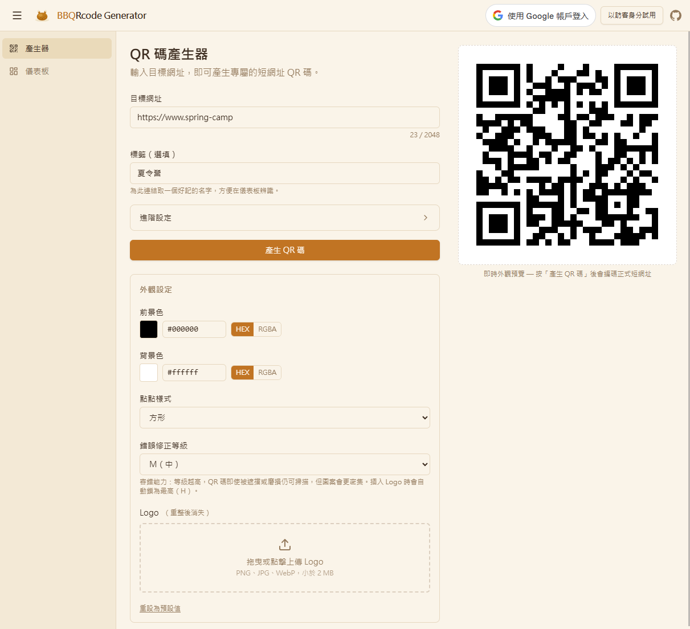
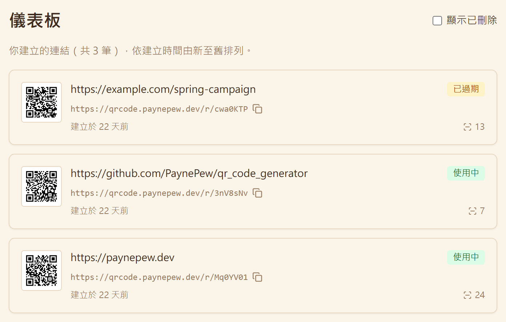

# QR Code Generator

[English](#english) · [繁體中文](#繁體中文)

A tool that turns URLs into short links and QR codes, with accounts, custom styling, and scan analytics.
把網址變成短連結和 QR Code 的小工具，附帳號、自訂樣式和掃描統計。

**Live at [qrcode.paynepew.dev](https://qrcode.paynepew.dev).** You can look around with the read-only demo account, no Google sign-in needed.
**線上版：[qrcode.paynepew.dev](https://qrcode.paynepew.dev)**，可以用唯讀 demo 帳號直接逛，不必登入 Google。

### Screenshots

*The generator: paste a URL and get a styled QR. 產生頁：貼上網址，拿到自訂樣式的 QR。*



*The dashboard: your links with their state and scan counts. Dashboard：自己的連結，含狀態和掃描次數。*



*Link detail: customization and scan analytics. 連結詳情：自訂樣式與掃描統計。*


---

## English

Paste in a URL and you get back a short link and its QR image. It started as a side project for practicing system design, then grew into a deployable multi-tenant service: Google sign-in, each person manages their own links, QR codes can be restyled, and scans record a small amount of analytics that cannot be traced back to an individual.

### Features

- Paste a destination URL and get a 7-character short link (a Base62 token) with its QR image. Every create makes a new token, so the same URL is never shared.
- Sign in with Google. The backend verifies the Google ID token once, then issues its own `httpOnly` session cookie instead of reusing Google's token. A shared read-only demo account is available if you just want to look around.
- Your dashboard lists the links you created, newest first, each showing its current state and total scan count. Soft-deleted links sit behind a trash filter.
- A link is in one of three states: `active`, `expired`, or `deleted`. An expired link can be reactivated by changing its expiry. Deletion is a soft delete and it is terminal, so a deleted link does not come back.
- QR codes can be customized: foreground color, background color, dot style, and an optional embedded logo. The style is saved per account (S3 in production, in memory locally), and error correction is raised automatically when a logo is present so the code still scans.
- Scan analytics are non-identifying by design. Each redirect keeps only coarse derived fields: country plus one administrative subdivision (a state or province, never a city) and a device class. The raw IP and user agent are never stored, and owners see totals rather than unique-visitor counts.
- A label is an optional, owner-private name for a link, useful for telling apart several links that point at the same URL.
- Rate limiting: link creation has a per-account quota, the auth endpoint has a per-IP cap, and both enforce an hourly and a daily window.

### Tech stack

| Layer | What it uses |
|---|---|
| Backend | Python, FastAPI, SQLAlchemy 2.0, Alembic, Pydantic v2 |
| Frontend | React 19, TypeScript, Vite, Tailwind CSS v4, TanStack Query/Form, React Router |
| Database | PostgreSQL |
| Object storage | AWS S3 for custom QR assets (an in-memory gateway locally) |
| Auth | Google OAuth ID token verification plus a signed session cookie |
| Geo | GeoLite2-City for offline country and subdivision lookup at scan time |
| QR rendering | qrcode for the backend vanilla image, qr-code-styling for the frontend custom render |
| Deploy | Docker, docker-compose, a single uvicorn worker, CloudFront CDN |

### Getting started

You need Python, Node, Docker (to run Postgres), and a Google OAuth client id.

Backend:

```bash
cp .env.example .env        # set SECRET, BASE_URL, DATABASE_URL, GOOGLE_CLIENT_ID
docker compose up -d db     # start Postgres
pip install -r requirements.txt
alembic upgrade head        # run database migrations
uvicorn backend.main:app --reload --port 8000
```

Frontend:

```bash
cd frontend
cp .env.example .env        # set VITE_GOOGLE_CLIENT_ID; leave VITE_API_BASE_URL empty for the same-origin proxy
npm install
npm run dev                 # http://localhost:5173
```

The session cookie only flows same-origin, so dev runs through the Vite proxy, which forwards `/api` and `/r` to the backend on `:8000`. If you run over plain HTTP locally, set `SESSION_COOKIE_SECURE=false` in the backend `.env`.

Customized-QR storage needs no AWS locally: with `AWS_S3_BUCKET` empty the backend uses an on-disk gateway that persists composites and logos under `backend/data/storage` (gitignored, auto-created), so customized images survive `--reload` restarts. Set `AWS_S3_BUCKET` + `AWS_REGION` only when you want real S3.

### Testing

```bash
pytest tests/                          # backend
npm run test --prefix frontend         # frontend unit tests (Vitest + MSW)
npm run typecheck --prefix frontend    # type check
npm run e2e --prefix frontend          # Playwright e2e
```

### API overview

| Method | Path | Purpose |
|---|---|---|
| POST | `/api/qr/create` | Create a link and QR |
| GET | `/api/qr` | List your links |
| GET | `/api/qr/{token}` | Link info |
| PATCH | `/api/qr/{token}` | Update url, label, or expiry (reactivation) |
| DELETE | `/api/qr/{token}` | Soft delete |
| GET | `/api/qr/{token}/image` | Get the QR image |
| GET, PUT | `/api/qr/{token}/customization` | Read or save styling |
| GET | `/api/qr/{token}/analytics` | Scan analytics |
| GET | `/r/{token}` | Public redirect |
| POST | `/api/auth/session` | Sign in with a Google ID token |
| POST | `/api/auth/demo-session` | Demo sign-in |
| DELETE | `/api/auth/session` | Sign out |
| GET | `/api/auth/me` | Current user |

### Configuration

A few environment variables worth knowing about. The full list is in `.env.example`:

- S3: set `AWS_S3_BUCKET` and `AWS_REGION` to store custom QR assets in S3. Leave them empty to use in-memory storage, which is fine for local dev.
- Geo: point `GEOIP_DB_PATH` at a `GeoLite2-City.mmdb` file to derive country and subdivision at scan time. Leave it empty to skip geo lookup.
- Rate limits: `RATE_LIMIT_*` is the per-account create quota, `AUTH_RATE_LIMIT_*` is the per-IP auth cap, and `RATE_LIMIT_ENABLED` is the master switch.

### Project layout

- `backend/`: the FastAPI app (routes, repositories, QR generation, scan derivation, storage gateway)
- `frontend/`: the React and Vite SPA (pages, components, api client, state)
- `alembic/`: database migrations
- `docs/`: design docs including ADRs and the roadmap
- `CONTEXT.md`: a domain glossary defining Link, Token, Scan, Ownership, and related terms

---

## 繁體中文

把一個網址貼進來，就會拿到一組短連結和對應的 QR 圖。一開始是拿來練系統設計的 side project，後來慢慢長成一個能部署的多租戶服務：有 Google 登入、每個人管自己的連結、QR 可以改樣式，掃描還會記一點不會回推到個人的統計。

### 功能

- 貼一個目標網址，產生一組 7 碼的短連結（Base62 token）和它的 QR 圖。每次建立都是新的 token，網址相同也不會共用。
- 用 Google 登入。後端只驗證一次 Google 的 ID token，之後發自己的 `httpOnly` session cookie，不直接沿用 Google 的 token。另外有一個共用的唯讀 demo 帳號可以直接試。
- 個人 Dashboard 列出你自己建立的連結，最新的在最上面，每筆顯示目前狀態和累計掃描次數。軟刪除的連結收在垃圾桶篩選裡。
- 連結有三種狀態：`active`、`expired`、`deleted`。過期的可以改到期時間重新啟用；刪除是軟刪除，而且是終點，不能再復原。
- QR 可以自訂前景色、背景色、點的樣式，也能嵌一張 logo。樣式存在帳號下（正式環境放 S3，本機用記憶體），有 logo 時會自動把容錯等級拉高，確保還掃得到。
- 掃描統計刻意做成不可回推個人。每次轉址只留粗粒度的衍生欄位：國家加一級行政區（縣市或州省，不到城市），以及裝置類別。原始 IP 和 User-Agent 一律不存，擁有者看到的是總次數，不是不重複訪客數。
- Label 是可選的連結備註名稱，只有擁有者看得到，用來分辨指向同一個網址的多組連結。
- 速率限制：建立連結是每個帳號一組額度，登入端點是每個 IP 一組上限，兩者都同時管小時和每日兩個窗口。

### 技術棧

| 層 | 用到的東西 |
|---|---|
| 後端 | Python, FastAPI, SQLAlchemy 2.0, Alembic, Pydantic v2 |
| 前端 | React 19, TypeScript, Vite, Tailwind CSS v4, TanStack Query/Form, React Router |
| 資料庫 | PostgreSQL |
| 物件儲存 | AWS S3（存自訂 QR 圖檔；本機用記憶體 gateway） |
| 認證 | Google OAuth ID token 驗證，加上簽章 session cookie |
| 地理 | GeoLite2-City（離線查詢，掃描時推算國家與行政區） |
| QR 產生 | qrcode（後端原始圖），qr-code-styling（前端自訂樣式） |
| 部署 | Docker, docker-compose, 單一 uvicorn worker, CloudFront CDN |

### 快速開始

前置條件：Python、Node、Docker（用來跑 Postgres），還有一組 Google OAuth client id。

後端：

```bash
cp .env.example .env        # 填 SECRET、BASE_URL、DATABASE_URL、GOOGLE_CLIENT_ID
docker compose up -d db     # 啟動 Postgres
pip install -r requirements.txt
alembic upgrade head        # 跑資料庫 migration
uvicorn backend.main:app --reload --port 8000
```

前端：

```bash
cd frontend
cp .env.example .env        # 設 VITE_GOOGLE_CLIENT_ID；VITE_API_BASE_URL 留空走同源 proxy
npm install
npm run dev                 # http://localhost:5173
```

session cookie 只在同源下傳遞，所以開發時走 Vite 的 proxy，把 `/api` 和 `/r` 轉給後端的 `:8000`。本機跑 HTTP 的話，記得把後端 `.env` 的 `SESSION_COOKIE_SECURE` 設成 `false`。

客製化 QR 的儲存在本機不需要 AWS：`AWS_S3_BUCKET` 留空時，後端會用磁碟 gateway 把合成圖與 logo 存在 `backend/data/storage`（已 gitignore、自動建立），所以客製化圖片在 `--reload` 重啟後也不會消失。只有要用真正的 S3 時才設 `AWS_S3_BUCKET` + `AWS_REGION`。

### 測試

```bash
pytest tests/                          # 後端
npm run test --prefix frontend         # 前端單元測試（Vitest + MSW）
npm run typecheck --prefix frontend    # 型別檢查
npm run e2e --prefix frontend          # Playwright e2e
```

### API 一覽

| 方法 | 路徑 | 用途 |
|---|---|---|
| POST | `/api/qr/create` | 建立連結與 QR |
| GET | `/api/qr` | 列出自己的連結 |
| GET | `/api/qr/{token}` | 連結資訊 |
| PATCH | `/api/qr/{token}` | 更新網址 / label / 到期時間（即重新啟用）|
| DELETE | `/api/qr/{token}` | 軟刪除 |
| GET | `/api/qr/{token}/image` | 取得 QR 圖 |
| GET, PUT | `/api/qr/{token}/customization` | 讀取或儲存樣式 |
| GET | `/api/qr/{token}/analytics` | 掃描統計 |
| GET | `/r/{token}` | 公開轉址 |
| POST | `/api/auth/session` | 用 Google ID token 登入 |
| POST | `/api/auth/demo-session` | demo 登入 |
| DELETE | `/api/auth/session` | 登出 |
| GET | `/api/auth/me` | 目前登入者 |

### 設定

幾個值得先知道的環境變數，完整清單在 `.env.example`：

- S3：填了 `AWS_S3_BUCKET` 和 `AWS_REGION` 就用 S3 存自訂 QR，留空則用記憶體，本機開發夠用。
- 地理：`GEOIP_DB_PATH` 指到 `GeoLite2-City.mmdb` 才會在掃描時推國家和行政區，留空就跳過。
- 速率限制：`RATE_LIMIT_*` 是每帳號建立額度，`AUTH_RATE_LIMIT_*` 是每 IP 登入上限，`RATE_LIMIT_ENABLED` 是總開關。

### 專案結構

- `backend/`：FastAPI 應用（路由、repository、QR 產生、掃描衍生、storage gateway）
- `frontend/`：React 加 Vite 的 SPA（pages、components、api client、state）
- `alembic/`：資料庫 migration
- `docs/`：ADR、roadmap 等設計文件
- `CONTEXT.md`：領域詞彙表，定義 Link、Token、Scan、Ownership 這些名詞
